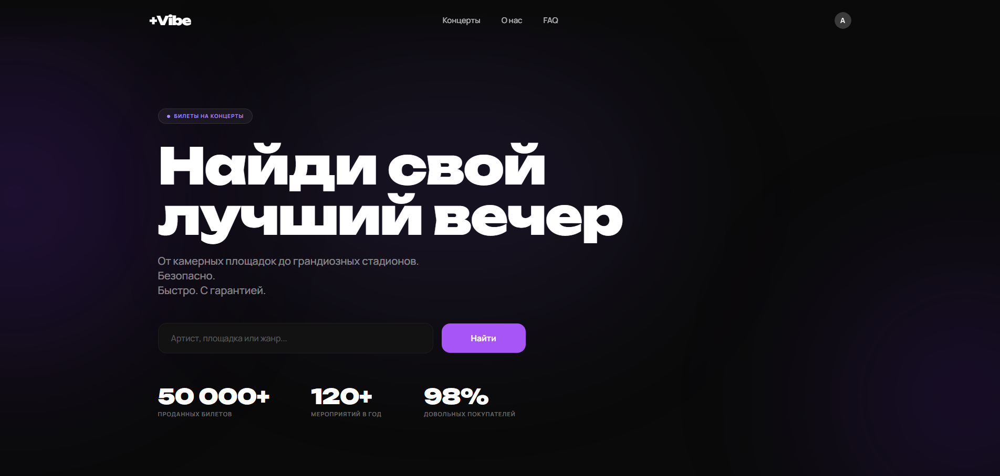
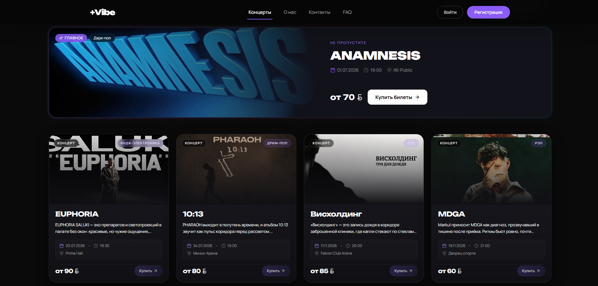
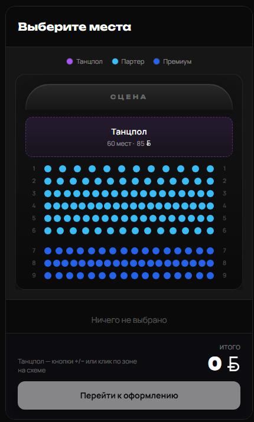
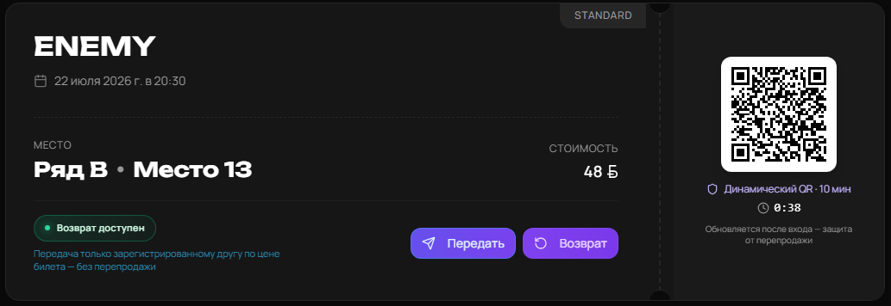
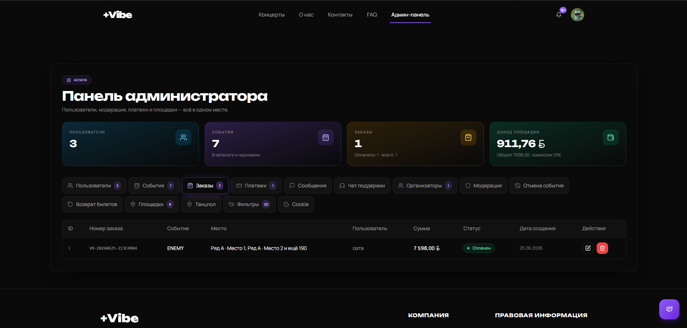

<div align="center">


# +Vibe

### Веб-платформа продажи билетов и управления концертами

Полный цикл: **афиша → схема зала → оплата → PDF/QR-билет → контроль на входе**

[](https://dotnet.microsoft.com/)
[](https://react.dev/)
[](https://www.postgresql.org/)
[](https://www.typescriptlang.org/)
[](https://ollama.com/)

[Демо локально](#-быстрый-старт) · [Скриншоты](#-скриншоты) · [Архитектура](#-архитектура) · [Документация](#-документация)

</div>

---

## О проекте

**+Vibe** — дипломный full-stack проект: билетная платформа для концертов в Беларуси. Три роли — **посетитель**, **организатор**, **администратор** — работают в одном приложении.

| Возможность | Что внутри |
|-------------|------------|
| 🎭 **Витрина** | Каталог, фильтры, поиск по артистам, «Главное» событие |
| 💺 **Схема зала** | Canvas, 8 схем минских площадок, до 4 500 мест, VIP / МГН |
| 🔐 **Безопасность** | JWT, OTP на e-mail, Google OAuth, ротирующий QR |
| 🎫 **Билеты** | PDF (QuestPDF), QR, возврат, передача другу |
| 📊 **Админка** | Модерация, комиссия 12%, аналитика, FAQ, поддержка |
| 🤖 **ИИ-чат** | Ollama (llama3.2) + эскалация оператору |

---

## Скриншоты

> Положи PNG в папку [`screenshots/`](./screenshots/) — имена файлов в [`screenshots/README.md`](./screenshots/README.md)

<table>
<tr>
<td width="50%"><br/><sub><b>Главная</b> — поиск и витрина</sub></td>
<td width="50%"><br/><sub><b>Каталог</b> — фильтры и карточки</sub></td>
</tr>
<tr>
<td><br/><sub><b>Схема зала</b> — Canvas, выбор мест</sub></td>
<td><br/><sub><b>Профиль</b> — QR и PDF</sub></td>
</tr>
<tr>
<td><br/><sub><b>Админ</b> — статистика и модерация</sub></td>
<td><br/><sub><b>Поддержка</b> — ИИ-ассистент</sub></td>
</tr>
</table>

---

## Архитектура

```
┌─────────────────┐     REST /api      ┌──────────────────────┐
│  React + Vite   │ ◄────────────────► │  ASP.NET Core 8      │
│  TypeScript     │     JWT            │  EF Core + Services  │
│  Tailwind UI    │                    │  MailKit · QuestPDF  │
└─────────────────┘                    └──────────┬───────────┘
                                                │
                                     ┌──────────▼───────────┐
                                     │  PostgreSQL 17       │
                                     │  23+ таблиц          │
                                     └──────────────────────┘

  Ollama (localhost:11434) ──► ИИ-чат поддержки
```

**Структура репозитория**

| Папка | Назначение |
|-------|------------|
| `front/` | React SPA (порт `5173`) |
| `backend/` | ASP.NET API (порт `5064`) |
| `docs/` | Инструкции, сценарий защиты |
| `screenshots/` | Картинки для README |
| `plantuml/` | UML-диаграммы |

---

## Быстрый старт

### Требования

- [Node.js 20+](https://nodejs.org/)
- [.NET SDK 8](https://dotnet.microsoft.com/download/dotnet/8.0)
- [PostgreSQL 17](https://www.postgresql.org/download/windows/)
- [Ollama](https://ollama.com/download) + `ollama pull llama3.2`

### Запуск

```powershell
# Терминал 1 — API
cd backend
dotnet run
# → http://localhost:5064

# Терминал 2 — фронт
cd front
npm install
npm run dev
# → http://localhost:5173
```

Настройки: `backend/appsettings.json`  
Очистка БД (оставить одного админа): `CLEAR_DATABASE_KEEP_ADMIN.sql`

---

## Документация

| Файл | Для кого |
|------|----------|
| [`docs/ZASHCHITA_SCENARIO.html`](./docs/ZASHCHITA_SCENARIO.html) | **Сценарий защиты** — что говорить и что открывать |
| [`docs/DLYA_MENYA_GITHUB_I_DUMP.md`](./docs/DLYA_MENYA_GITHUB_I_DUMP.md) | Залить на GitHub + сделать дамп БД |
| [`docs/DLYA_DRUGA.md`](./docs/DLYA_DRUGA.md) | Друг: clone, Ollama, запуск |
| [`docs/DLYA_DRUGA_VOSSTANOVLENIE_BAZY.md`](./docs/DLYA_DRUGA_VOSSTANOVLENIE_BAZY.md) | Друг: pgAdmin, restore, пароли |
| [`docs/DEPLOY_ONLINE.md`](./docs/DEPLOY_ONLINE.md) | Деплой на Render + Neon |

---

## Стек

**Backend:** C# · ASP.NET Core 8 · EF Core · Npgsql · JWT · BCrypt · MailKit · QuestPDF · QRCoder · ImageSharp  

**Frontend:** React 18 · TypeScript · Vite · React Router · TanStack Query · Radix UI · Tailwind · Framer Motion · Playwright (E2E)

**БД:** PostgreSQL — пользователи, события, места, заказы, платежи, модерация, поддержка, FAQ

---

## Лицензия

Учебный дипломный проект. © 2024–2026

<div align="center">
<sub>Сделано с 💜 для живой музыки</sub>
</div>
